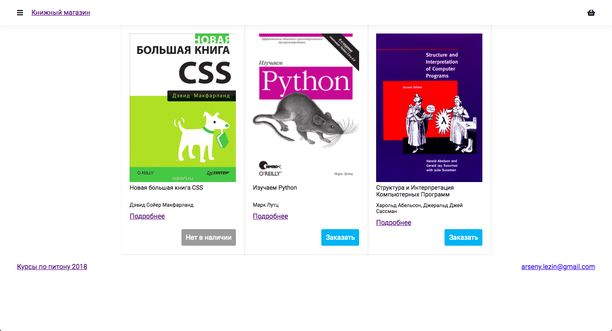
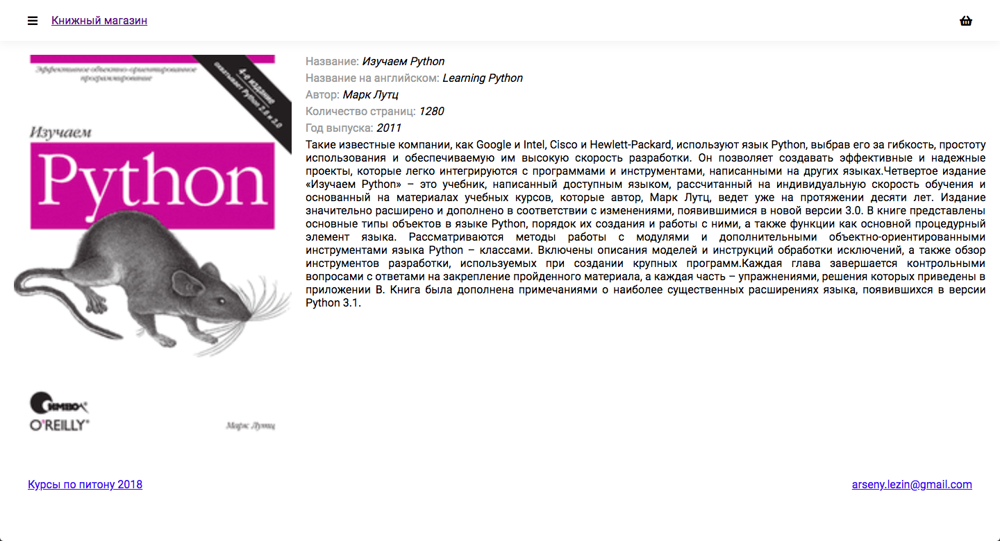

Домашнее задание "Книжный магазин"
===

Фронтенд разработчик Петя долго и усердно работал и сделал все по макетам.

Но вот проблема, Петя ничего не знает о шаблонизаторах.

У него есть такие хорошие разработчики как вы и поэтому он попросил у вас помощи. 

### Задание

В `./main/templates/main/` лежит `index.html` который отвечает за отображение главной страницы

В `./catalog/templates/catalog/` лежит `detail.html` который отвечает за отображение страницы товара

Нужно:

1) Подключить css-файлы `./static/css/fonts.css` и `./static/css/style.css`
2) На главной странице должны отображаться информация о книгах (В контекст приходит список объектов `books`). Подсказка: class `.book-preview` на главной странице
3) На странице с информацией должна отображаться актуальная информация (В контекст приходит объект `book`)
4) Кнопка "Заказать" отображается в случае если нужно `book.is_available == True` иначе отображается кнопка "Нет в наличии"
5) Должен быть базовый шаблон `base.html` и лежать в `./templates/base.html`

Задание считается выполненым если:

1) Страница `/` выглядит примерно так
 

2) Страница `/catalog/{id}` выглядит примерно так

3) `/` и `/catalog/{id}` выдают 200-е ответы

